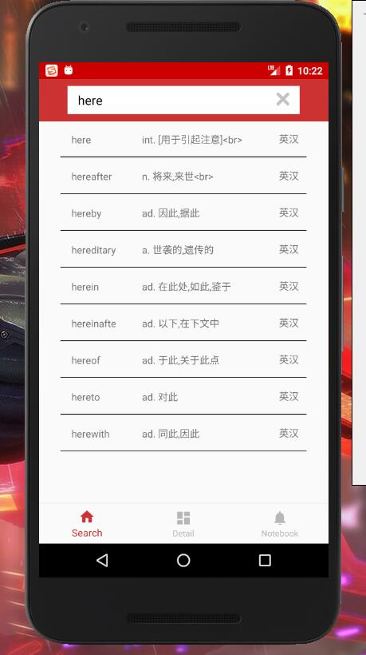
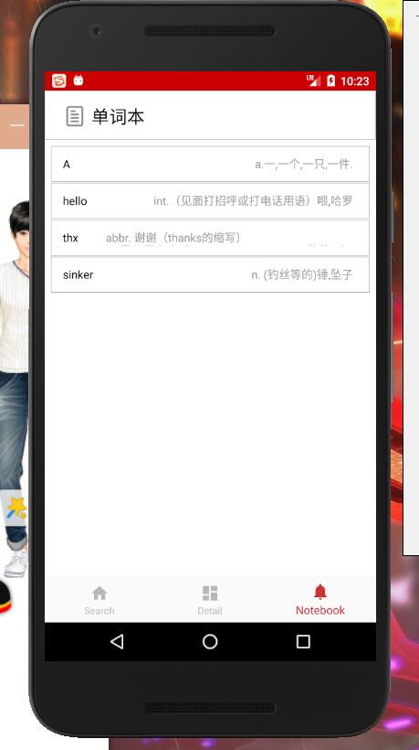

## EasyLearning
#### An application for learning English

There are 3 major functions of this app: 

1. Translating English into Chinese
2. Translating Chinese into English
3. Recording important in notebook

The 3 most important parts of this application are:
1. UI implementation
2. Database
3. Online API

#### UI implementation
There are 3 pages in this app(search/detail/notebook), each of them is binded to a fragment. page switching is control by BottomNavigationView.

#### Database
SQLite databse is used for storing local data.

#### Online API
Youdao API is used for searching words online.
When internet is available and the word that is been searched is not found in local database, Youdao API will be called to fetch data from the internet.

